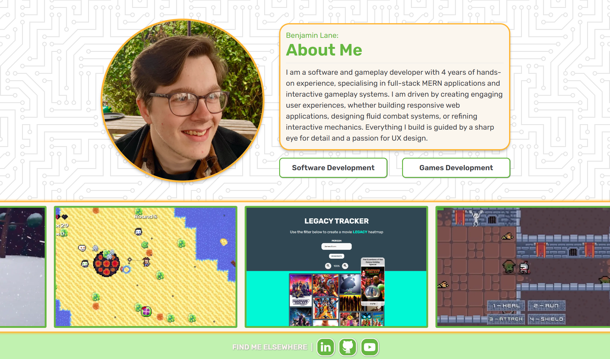

# 🎬 Benjamin Lane Portfolio

My portfolio showcasing projects in both game and software development.

---

## 📷 Preview

<!-- Tip: Use a high-quality GIF or screenshot showing the primary interaction in action -->

---

## ✨ Key Features & Technical Highlights

* **Featured Work Carousel:** High-visibility spotlight carousel showcasing select top-tier projects with smooth touch/swipe gestures and accessible control primitives.
* **Dynamic Skill Filtering:** Real-time project grid filtering powered by interactive skill badges, complete with an expandable/collapsible filter drawer and single-click state resets.
* **Async Data Fetching:** Asynchronously fetches project schemas from external JSON data files.
* **Accessible & Responsive Layout:** Styled with utility-first **Tailwind CSS** flexbox/grid layouts to ensure seamless mobile-to-desktop responsiveness.
* **Strict Type Safety:** Built with end-to-end **TypeScript** interface definitions to prevent runtime rendering bugs.

---

## 🛠️ Tech Stack & Resources

* **Core Framework & Language:**
  * `Typescript` – Type-safe application logic and async data fetching.
  * `React` – Component-based UI architecture. 
  * `Vercel` – Page hosting. 

* **Build & Routing:**
  * `Vite` – Fast development tooling and production bundling.
  * `React Router` – Client-side single page application routing.

* **Styling & Design:**
  * `CSS` – Global style resets and UI component modules.
  * `Tailwind CSS` – CSS Utility framework for rapid, consistent and responsive layout design.
  * `Radix UI` – Unstyled and accessible UI primitive's.
  * `Shadcn/UI` – Re-usable and customisable UI components.

---

## 🩹 Known Issues

* **Performance:**
> * **Unnecessary React re-renders slow down certain project interactions**

---

## 🌟 Future Updates

* **Project Pagination:** To optimise the loading of too many projects.
* **Github History:** Show recent commit data from my personal github

---

## 📃 Credits

* **Google Fonts:** Rubik | [Google Fonts](https://fonts.google.com/specimen/Rubik)
* **Google Font Icons:** Drop Up | [Google Font Icons](https://fonts.google.com/icons?selected=Material+Symbols+Outlined:arrow_drop_up:FILL@0;wght@400;GRAD@0;opsz@24&icon.query=drop+up&icon.size=24&icon.color=%23e3e3e3)
* **Steve Schoger:** Hero Pattern BG | [Steve Schoger](https://heropatterns.com/)
* **Andrean Prabowo:** User icon used for the tab image | [Flaticon](https://www.flaticon.com/free-icon/user_5582872?term=people&page=2&position=96&origin=tag&related_id=5582872)

---